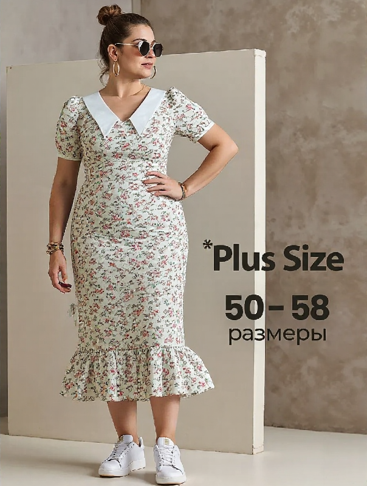
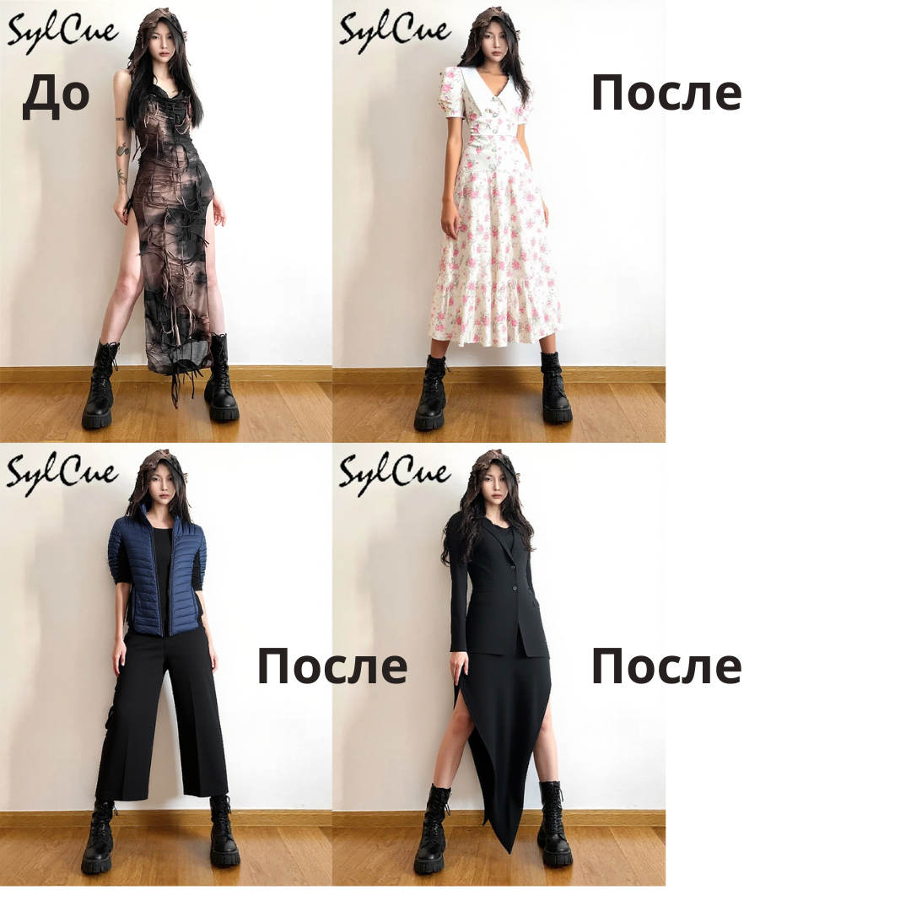

# ComfyUI Image Collection

This repository contains a set of images generated or processed on May 29, 2025.

## ComfyUI PNG Images

  
  
  
  
  
  
  
  
  
  
  
  

## Originals and Other Images

  
  
  
  
  
  
  
  

## Files

- `Kusanov.json` — metadata or config file
- `desktop.ini` — system file, can be ignored

---

Click on any image to view it in full size.
